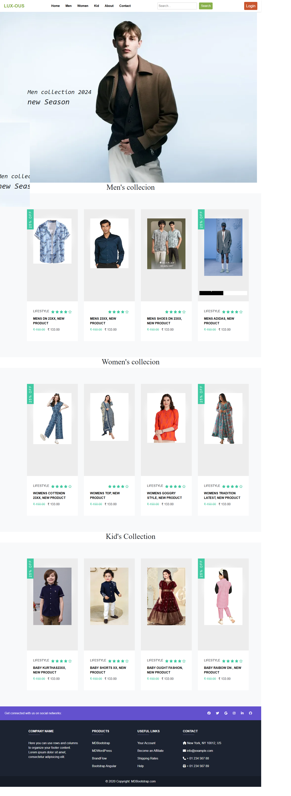

# Node.js E-commerce Application

This is a full-stack e-commerce web application built using Node.js, Express, and MongoDB. It includes an admin dashboard for managing products, users, and orders, a coupon code feature for discounts, a scratch win functionality for promotions, login via Gmail, and Razorpay for secure payments during checkout.

## Features

- **Admin Dashboard**: Manage products, users, and orders easily with an interactive admin panel.
- **Coupon Code Functionality**: Apply discount codes to orders for promotional purposes.
- **Scratch Win**: Users can participate in a scratch win feature to win discounts or products.
- **Login with Gmail**: Secure login functionality via Google using OAuth.
- **Checkout and Payments**: Razorpay integration for secure payment handling during checkout.

## Tech Stack

- **Node.js**: Backend JavaScript runtime environment.
- **Express.js**: Web framework for Node.js to handle routing.
- **MongoDB**: NoSQL database for storing product and user data.
- **Mongoose**: MongoDB ODM for easy data modeling.
- **Passport.js**: Authentication middleware for Node.js to handle Gmail login.
- **Razorpay**: Payment gateway for secure online transactions.
- **HBS**: Templating engine for rendering views.
- **CSS/Bootstrap**: Front-end styling framework for responsive design.

## Installation

### Prerequisites

Before you begin, ensure that you have the following installed:

- [Node.js](https://nodejs.org/en/) (LTS version)
- [MongoDB](https://www.mongodb.com/) (Local or a hosted MongoDB service like MongoDB Atlas)
- [Razorpay Account](https://razorpay.com/) for API keys.
- A **Google Developer account** for OAuth authentication (Gmail login).

